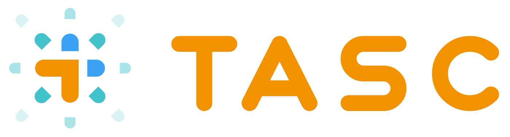

# TASC - Generative AI for Contract Management



## Overview

TASC (Transformative AI for Smart Contracts) is a comprehensive Streamlit web application designed to streamline contract management processes using generative AI. The application leverages Capgemini's Generative Engine to provide intelligent contract analysis, drafting, comparison, and information extraction capabilities.

## Features

### Contract Drafting
Generate professional contract drafts and clauses based on specific requirements. The system can create:
- Complete procurement contracts
- Specialized contract clauses (renewal terms, insurance, termination, etc.)
- Customized legal documents based on detailed specifications

### Contract Extraction
Extract key information from existing contracts with high accuracy:
- Document names and parties
- Governing laws and jurisdictions
- Insurance clauses and effective dates
- Renewal terms and other critical contract elements

### Contract Compare
Compare two contracts to identify differences and similarities:
- Side-by-side comparison in table format
- Highlight key differences between contract versions
- Identify missing or additional clauses

### Contract Inconsistencies
Detect inconsistencies within contracts based on predefined rules:
- Check for conflicting governing laws
- Identify duplicate or contradictory clauses
- Ensure compliance with organizational standards

### Contract Terms Search
Find similar contract terms in a database of previously reviewed contracts:
- Semantic search using embedding technology
- Display top matches with similarity scores
- Help reuse validated contract language

### Contract Assistant
Interactive chatbot interface for contract-related queries:
- Ask questions about specific contracts
- Get expert guidance on contract management
- Maintain conversation context across multiple interactions

## Technical Architecture
TASC is built using:
- **Streamlit**: For the web interface and interactive components
- **Capgemini Generative Engine**: For AI-powered text generation and analysis
- **PyPDF** and **PyMuPDF**: For PDF processing and text extraction
- **Sentence Transformers**: For semantic search capabilities
- **WebSocket**: For real-time communication with the Generative Engine API

## Getting Started

### Prerequisites
- Python 3.8+
- Required Python packages (see `requirements.txt`)
- Access credentials for Capgemini Generative Engine

### Installation

1. Clone the repository:
```bash
git clone https://gitlab.com/your-organization/tasc.git
cd tasc
```

2. Install dependencies:
```bash
pip install -r requirements.txt
```

3. Set up your API credentials:
   - Ensure you have the required API key for Capgemini Generative Engine
   - Place your credentials file in the project directory (if applicable)

### Running the Application

Launch the application with:
```bash
streamlit run main_tasc.py
```

The application will be available at `http://localhost:8501` by default.

## Usage

1. Select the desired functionality from the sidebar
2. Follow the on-screen instructions for each tool:
   - Upload contracts as PDF or TXT files
   - Enable OCR for scanned documents if needed
   - Enter specific requirements or questions
   - Submit your request and view the results

## File Structure

```
tasc/
├── main_tasc.py                    # Main application entry point
├── pages/                          # Directory containing all feature pages
│   ├── Chatbot.py                  # Contract assistant chatbot
│   ├── Contract_Compare_GenEngine.py   # Contract comparison tool
│   ├── contract_drafting_GenEngine.py  # Contract drafting tool
│   ├── contract_extract_GenEngine.py   # Information extraction tool
│   ├── Contract_inconsistencies_GenEngine.py  # Inconsistency detection
│   └── Contract_Terms_Search.py    # Similar terms search tool
├── TASC-orange-horizontal-logo.png # Application logo
└── requirements.txt                # Python dependencies
```

## Future Enhancements

- Integration of agentic systems for advanced contract analysis

## Contributing

Please contact the project maintainers for information about contributing to this project.

## License

This project is proprietary and confidential. Unauthorized copying, transferring, or reproduction of the contents of this project, via any medium, is strictly prohibited.

## Contact

For questions or support, please contact:
- Akhli RIOUFFREYT - akhli.riouffreyt@capgemini.com

---

*Developed by Capgemini*
